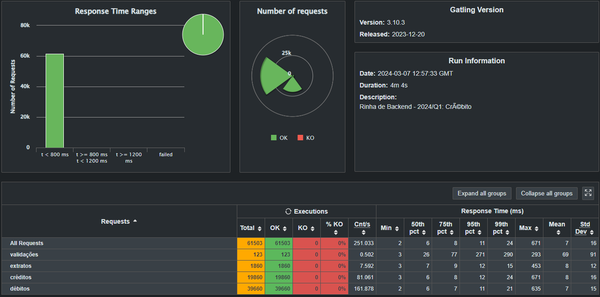

## Submissão para Rinha de Backend, Segunda Edição: 2024/Q1 - Controle de Concorrência

### Submissão feita com:

- `Go` para api com o framework `Gin Web Framework`
- `nginx` como load balancer
- `postgres` como banco de dados
- [repositório da api](https://github.com/4emcos/rinha-de-backend-2024-q1-golang)


### Como rodar a aplicação

```bash
  docker-compose -f docker-compose-local.yml up -d
```

### Resultado dos testes 


[@4emcos](https://twitter.com/4emcos) @ twitter
[@4emcos](https://www.linkedin.com/in/4emcos/) @ linkedin
